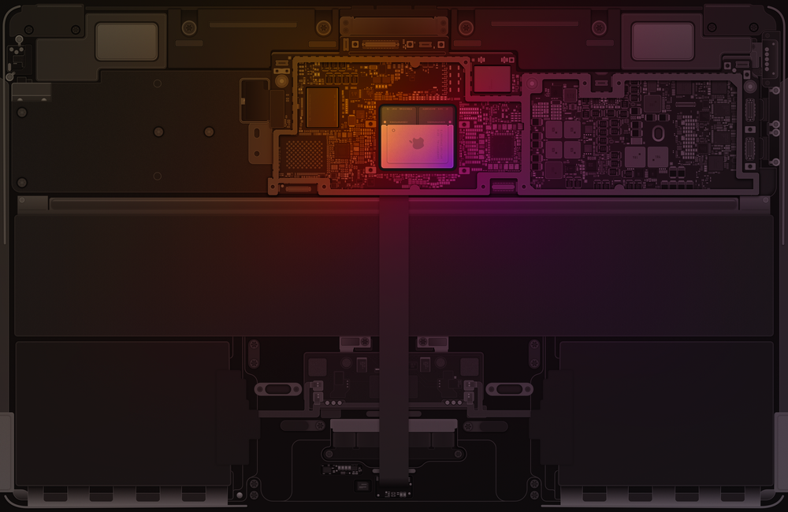

# Bordspil-Verksmidja
Rafrænt borðspil verkefni - Verksmiðja K2 - 2024

**Þetta er verkefni í áfanganum - VESM1KT05AK Verksmiðja K2 Vorið 2024**

Höfundar: Ella Sigurðardóttir, Kristófer Birgisson og Stefan Erlendur.

